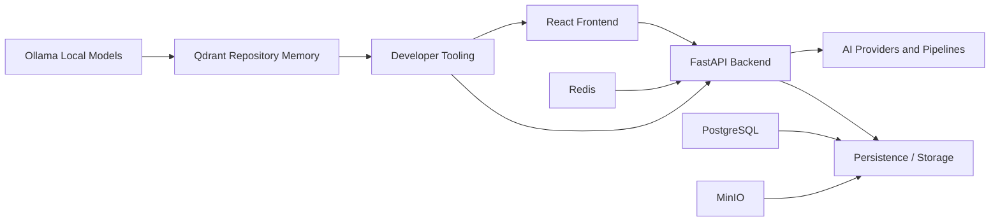

# LUMINA Architecture Inventory

Generated: `2026-08-02T07:48:46.506674+00:00`

Total code files: **391**

## Code areas

| Area | Files |
|---|---:|
| `frontend` | 162 |
| `_local_models` | 120 |
| `backend` | 88 |
| `launcher` | 14 |
| `scripts` | 4 |
| `playable_release_evidence` | 2 |
| `_tools` | 1 |

## Languages

| Extension | Files |
|---|---:|
| `.py` | 229 |
| `.jsx` | 106 |
| `.js` | 56 |

## Most referenced dependencies

| Dependency | References |
|---|---:|
| `react` | 104 |
| `__future__` | 103 |
| `os` | 97 |
| `typing` | 61 |
| `lucide-react` | 59 |
| `torch` | 57 |
| `pathlib` | 53 |
| `numpy` | 46 |
| `@/lib` | 42 |
| `..` | 40 |
| `cv2` | 38 |
| `json` | 38 |
| `time` | 36 |
| `sys` | 36 |
| `.` | 30 |
| `subprocess` | 27 |
| `datetime` | 27 |
| `asyncio` | 24 |
| `dataclasses` | 19 |
| `math` | 19 |
| `glob` | 17 |
| `sonner` | 17 |
| `utils` | 16 |
| `collections` | 16 |
| `io` | 16 |
| `shutil` | 16 |
| `argparse` | 16 |
| `models` | 16 |
| `react-router-dom` | 16 |
| `logging` | 15 |

## Largest code files

| File | Size (KB) |
|---|---:|
| `backend/server.py` | 199.1 |
| `backend/code_builder/patch_service.py` | 142.5 |
| `backend/code_builder/planning_service.py` | 130.7 |
| `backend/code_builder/task_service.py` | 120.0 |
| `backend/code_builder/build_service.py` | 103.5 |
| `backend/code_builder/repository_service.py` | 102.0 |
| `backend/code_builder/ollama_service.py` | 94.4 |
| `backend/code_builder/router.py` | 84.7 |
| `backend/talking_portrait_providers/liveportrait_provider.py` | 59.3 |
| `frontend/src/pages/DocumentStudio.jsx` | 57.7 |
| `backend/document_studio/service.py` | 56.6 |
| `_local_models/LivePortrait/src/utils/dependencies/XPose/models/UniPose/deformable_transformer.py` | 55.6 |
| `backend/code_builder/security.py` | 53.7 |
| `backend/tests/backend_test.py` | 46.4 |
| `backend/document_studio/router.py` | 45.8 |
| `backend/code_builder/backup_service.py` | 38.4 |
| `frontend/src/pages/Editor.jsx` | 36.7 |
| `_local_models/LivePortrait/src/gradio_pipeline.py` | 34.2 |
| `backend/code_builder/models.py` | 34.0 |
| `_local_models/LivePortrait/src/live_portrait_pipeline.py` | 32.9 |
| `frontend/src/pages/VideoEditor.jsx` | 32.6 |
| `_local_models/LivePortrait/src/utils/dependencies/XPose/models/UniPose/transformer_deformable.py` | 27.6 |
| `_local_models/LivePortrait/src/utils/dependencies/XPose/models/UniPose/swin_transformer.py` | 27.4 |
| `_local_models/LivePortrait/src/utils/dependencies/XPose/models/UniPose/unipose.py` | 26.8 |
| `frontend/src/pages/VoiceStudio.jsx` | 26.4 |

## High-level system map

